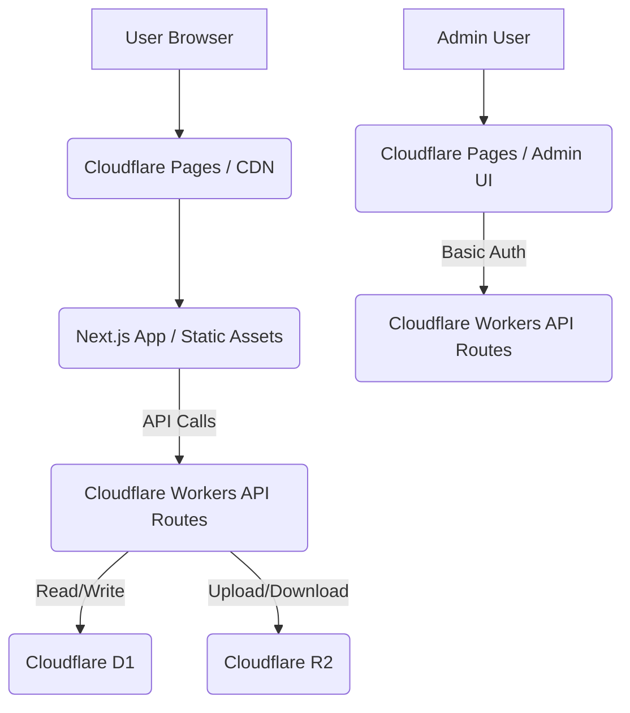

### プロジェクト要件定義書

**プロジェクト名**: 日本古典文学 音読コンテンツ配信サイト「古の音（いにしえのね）」 (仮)

**作成日**: 2023年10月27日
**バージョン**: 1.0

---

#### 1. プロジェクト概要

1.1. **目的**
    *   日本語ネイティブ話者による古典原典の朗読コンテンツを配信し、海外の日本語・古語・古典文化学習者、および日本の古典愛好家へ、古典文学の新たな魅力を届ける。
    *   将来的にはサブスクリプション課金によるマネタイズ（Stripe連携）を目指す。

1.2. **ターゲットユーザー**
    *   **メイン**: 日本語、古語、および日本の古典文化を学習したい海外在住者。特に、言葉の響きや音を通して古典に触れたいと考える層。
    *   **サブ**: 日本の古典文学に興味があり、音読コンテンツを通じて新たな鑑賞体験を求める国内ユーザー。

1.3. **コアコンセプト**
    *   「日本語ネイティブ話者である私自身が口伝で古典の原典を朗読する」という、唯一無二の体験をユーザーに提供する。この点が他サービスとの最大の差別化ポイントとなる。
    *   シンプルかつ洗練されたUI/UXで、コンテンツへのアクセスを容易にし、学習・鑑賞のハードルを下げる。

1.4. **MVP (Minimum Viable Product) の定義**
    *   本プロジェクトの最初のフェーズ（約20時間以内での達成目標）として、以下の最小限の機能群を実装する。
        *   一般ユーザー向け: 記事（チャプター）のリスト表示と詳細表示、音源再生機能（再生/一時停止、早送り/巻き戻し、再生速度変更、連続再生）。
        *   管理者向け: 記事（作品・チャプター）の作成・編集・削除、音源ファイルのアップロード・管理、マスタデータ（作品、著者、カテゴリ）の管理。
        *   サイトの基本表示（3カラムレイアウト、EnglishベースのUI/UX）。

---

#### 2. 機能要件

2.1. **一般ユーザー向け機能 (フロントエンド)**

1.  **サイト表示機能**
    *   **コンテンツ一覧表示**: トップページまたは専用ページにて、作品のリスト（タイトル、著者名、カテゴリなど）を表示する。
    *   **作品詳細ページ**:
        *   選択された作品の概要と、紐づくチャプター（朗読コンテンツ）の一覧を表示する。
        *   各チャプターには、チャプター名、再生ボタンなどを表示する。
    *   **チャプター詳細ページ**:
        *   選択されたチャプターのタイトル、朗読プレイヤー、記事本文（マークダウン形式のテキスト）を表示する。
        *   必要に応じて、関連作品、人気記事、目次、広告などの補完情報を右カラムに表示する。
    *   **検索機能**: 作品名、著者名をキーワードとしてコンテンツを検索できる。
    *   **UIレイアウト**:
        *   左ナビゲーションエリア: 作品一覧、著者一覧、カテゴリ、検索機能へのリンクを配置。
        *   中央メインエリア: 選択されたコンテンツの本文、朗読プレイヤー、チャプター一覧などを表示。
        *   右補完ナビゲーションエリア: 関連作品、人気記事、目次、広告などを表示。
    *   **UI/UXの多言語対応**:
        *   サイトのUIテキスト（ナビゲーション、ボタン、ラベルなど）はEnglishをベースとして表示する。
        *   フッターまたはヘッダーにUI言語切り替えセレクタ（例: English / 日本語）を配置し、ユーザーが任意のUI言語を選択できるようにする。
        *   朗読コンテンツ自体は純日本語であり、記事本文も日本語で提供される。将来的に記事本文の英語訳追加も視野に入れるが、MVPでは対象外。
2.  **朗読再生機能**
    *   **基本操作**: 音源の再生、一時停止。
    *   **シーク機能**: 早送り、巻き戻し（例: 10秒単位）。
    *   **再生速度調整**: 複数の再生速度オプション（例: 0.75x, 1x, 1.25x, 1.5xなど）を選択可能。
    *   **バックグラウンド再生**: ブラウザおよびOSが対応している場合、サイトから離れても再生が継続される。
    *   **連続再生**: 現在のチャプターが終了した後、自動的に次のチャプターへ移行し再生を開始する。
3.  **レスポンシブデザイン**:
    *   PC、タブレット、スマートフォンの各デバイスサイズに適応した表示および操作性を提供する。

2.2. **管理者向け機能 (管理画面)**

1.  **認証機能**:
    *   管理画面へのアクセスはBasic認証によって制限される。正しいユーザー名とパスワードを入力した管理者のみがアクセス可能。
2.  **記事管理機能**:
    *   **新規作成**: 新たな作品（親記事）およびそれに紐づくチャプター（子記事）を登録できる。
        *   作品登録時: 作品名（日本語、英語）、著者ID、概要などを入力。
        *   チャプター登録時: チャプターの順序、チャプター名（日本語、英語）、紐づく作品ID、音源ファイル、記事本文（マークダウン形式）を入力。
    *   **編集**: 既存の作品、またはチャプターの記事内容を修正できる。
    *   **削除**: 既存の作品、またはチャプターの記事を削除できる。
    *   **マークダウンエディタ**: 記事本文の入力には、マークダウン形式をサポートするエディタを提供する。
3.  **音源管理機能**:
    *   **アップロード**: 朗読コンテンツとして使用するAACファイルをアップロードできる。
        *   ファイルサイズ目安: 10MB以内。
        *   長さ目安: 10分以内。
    *   **一覧表示**: アップロード済みの音源ファイルとそのメタデータ（ファイル名、サイズなど）を表示する。
    *   **削除**: アップロード済みの音源ファイルをストレージから削除できる。
4.  **マスタデータ管理機能**:
    *   **作品マスタ**: 作品名（日本語、英語）の作成、編集、削除。
    *   **著者マスタ**: 著者名（日本語、英語）、略歴などの作成、編集、削除。
    *   **カテゴリマスタ**: カテゴリ名（日本語、英語）の作成、編集、削除。

---

#### 3. 非機能要件

3.1. **パフォーマンス**
    *   **高速表示**: Next.jsのSSG (Static Site Generation) を基本とし、プリレンダリングされたページによる高速な表示速度を実現する。
    *   **CDN活用**: Cloudflare CDN (Cloudflare Pages) を通じたコンテンツ配信により、世界中のユーザーへ低遅延でコンテンツを提供する。特に音源ファイル（R2）の配信を最適化する。

3.2. **スケーラビリティ**
    *   **アーキテクチャ**: Cloudflare Workers/Pages, Cloudflare D1, Cloudflare R2というサーバレス・エッジコンピューティング基盤により、アクセス数の増加やコンテンツ量の増加に柔軟に対応できる。

3.3. **セキュリティ**
    *   **プラットフォームセキュリティ**: CloudflareによるDDoS攻撃対策、WAF (Web Application Firewall) など、堅牢なインフラレベルのセキュリティ恩恵を受ける。
    *   **管理画面アクセス制限**: Basic認証による管理画面へのアクセス制御を実装し、不正なアクセスから保護する。
    *   **データ保護**: D1およびR2へのアクセスは、適切な認証・認可メカニズムによって保護される。

3.4. **運用・保守**
    *   **CI/CD**: GitHubリポジトリへのプッシュをトリガーとしたCloudflare Pagesの自動デプロイを構成する。
    *   **ロギング**: Cloudflare Workers/Pagesの提供するロギング機能を利用し、アプリケーションのエラーや動作状況を把握できるようにする。
    *   **モニタリング**: MVP段階では基本的なロギングに留め、将来的にアクセス解析ツール（Google Analytics等）やエラー監視ツール（Sentry等）の導入を検討する。

3.5. **開発期間・体制**
    *   **開発期間**: MVP機能の実装目標は20時間以内。
    *   **開発体制**: 個人開発（Gemini Code Assistantを積極的に活用）。

---

#### 4. 技術スタック

4.1. **主要技術**
    *   **フレームワーク**: Next.js (App Router, SSGを基本としたレンダリング戦略)
    *   **ホスティング**: Cloudflare Pages
    *   **データベース**: Cloudflare D1 (SQLite互換、エッジデータベース)
    *   **オブジェクトストレージ**: Cloudflare R2 (音源ファイル等の格納)
    *   **プログラミング言語**: TypeScript

4.2. **フロントエンド技術**
    *   **CSSフレームワーク**: Tailwind CSS (ユーティリティファーストのアプローチで、高速かつ堅牢なスタイリングを実現)
    *   **状態管理**: React Context API (小規模アプリケーションのシンプルな状態管理に最適)
    *   **フォームライブラリ**: React Hook Form (軽量で高パフォーマンス、バリデーション機能も充実)
    *   **オーディオプレイヤー**: HTML5 `<audio>` タグをベースとした自作Reactコンポーネント (シンプルさ、堅牢性、依存関係の少なさを重視)
    *   **マークダウン表示**: `react-markdown`

4.3. **管理画面技術**
    *   **マークダウンエディタ**: `react-simple-mde-editor` (シンプルなMarked.jsベースのマークダウンエディタ)
    *   **認証**: Basic認証 (管理画面アクセス制御)

4.4. **開発・デプロイ**
    *   **バージョン管理**: Git / GitHub
    *   **CI/CD**: Cloudflare PagesのGitHub連携による自動デプロイ

---

#### 5. システム構成図 (概念図)


**図**: ユーザーはCloudflare Pages経由でNext.jsアプリケーションにアクセス。APIリクエストはCloudflare Workersを介してD1（記事・メタデータ）やR2（音源ファイル）と連携する。管理ユーザーも同様の経路で、Basic認証を経て管理UIを利用する。

#### 6. データモデル素案 (Cloudflare D1)

*   **`authors` テーブル**
    *   `id` (TEXT, PRIMARY KEY)
    *   `name_jp` (TEXT, NOT NULL)
    *   `name_en` (TEXT)
    *   `bio_jp` (TEXT)
    *   `bio_en` (TEXT)
    *   `created_at` (TEXT, DEFAULT CURRENT_TIMESTAMP)
    *   `updated_at` (TEXT, DEFAULT CURRENT_TIMESTAMP)

*   **`works` テーブル**
    *   `id` (TEXT, PRIMARY KEY)
    *   `author_id` (TEXT, FOREIGN KEY REFERENCES authors(id), NOT NULL)
    *   `title_jp` (TEXT, NOT NULL)
    *   `title_en` (TEXT)
    *   `description_jp` (TEXT)
    *   `description_en` (TEXT)
    *   `created_at` (TEXT, DEFAULT CURRENT_TIMESTAMP)
    *   `updated_at` (TEXT, DEFAULT CURRENT_TIMESTAMP)

*   **`chapters` テーブル**
    *   `id` (TEXT, PRIMARY KEY)
    *   `work_id` (TEXT, FOREIGN KEY REFERENCES works(id), NOT NULL)
    *   `chapter_order` (INTEGER, NOT NULL)
    *   `title_jp` (TEXT, NOT NULL)
    *   `title_en` (TEXT)
    *   `audio_url` (TEXT, NOT NULL)
    *   `content_jp` (TEXT)
    *   `content_en` (TEXT)
    *   `duration_seconds` (INTEGER)
    *   `created_at` (TEXT, DEFAULT CURRENT_TIMESTAMP)
    *   `updated_at` (TEXT, DEFAULT CURRENT_TIMESTAMP)

*   **`categories` テーブル**
    *   `id` (TEXT, PRIMARY KEY)
    *   `name_jp` (TEXT, NOT NULL)
    *   `name_en` (TEXT)
    *   `created_at` (TEXT, DEFAULT CURRENT_TIMESTAMP)
    *   `updated_at` (TEXT, DEFAULT CURRENT_TIMESTAMP)

*   **`chapter_categories` テーブル (中間テーブル)**
    *   `chapter_id` (TEXT, FOREIGN KEY REFERENCES chapters(id))
    *   `category_id` (TEXT, FOREIGN KEY REFERENCES categories(id))
    *   PRIMARY KEY (`chapter_id`, `category_id`)

---

#### 7. ディレクトリ構成素案 (Next.js App Router)

```
/classicjlit
├── app/
│   ├── (frontend)/           # 一般ユーザー向けUIのルート
│   │   ├── layout.tsx
│   │   ├── page.tsx          # トップページ
│   │   ├── works/
│   │   │   ├── [workId]/
│   │   │   │   ├── page.tsx      # 作品詳細ページ
│   │   │   │   └── chapters/
│   │   │   │       ├── [chapterId]/
│   │   │   │       │   └── page.tsx  # チャプター詳細ページ（朗読プレイヤー含む）
│   │   │   └── search/
│   │   │       └── page.tsx  # 検索結果ページ
│   │   ├── components/       # 共通コンポーネント (ヘッダー、フッター、ナビなど)
│   ├── (admin)/             # 管理画面UIのルート
│   │   ├── layout.tsx
│   │   ├── page.tsx          # 管理画面ダッシュボード
│   │   ├── works/
│   │   │   ├── page.tsx      # 作品一覧・管理
│   │   │   ├── new/page.tsx  # 新規作品作成
│   │   │   └── [workId]/
│   │   │       ├── edit/page.tsx # 作品編集
│   │   │       └── chapters/
│   │   │           ├── page.tsx      # チャプター一覧・管理
│   │   │           ├── new/page.tsx  # 新規チャプター作成
│   │   │           └── [chapterId]/
│   │   │               └── edit/page.tsx # チャプター編集
│   │   ├── authors/          # 著者マスタ管理
│   │   ├── categories/       # カテゴリマスタ管理
│   │   └── settings/         # 管理画面設定など
│   ├── api/                 # API Routes (Cloudflare Workersとして動作)
│   │   ├── works/
│   │   ├── authors/
│   │   ├── chapters/
│   │   ├── categories/
│   │   ├── auth/            # Basic認証処理など
│   │   └── upload/          # R2へのファイルアップロード処理
│   ├── layout.tsx           # ルートレイアウト
│   └── middleware.ts        # Basic認証などのミドルウェア
├── public/                  # 静的ファイル (ファビコンなど)
├── src/                     # その他ユーティリティ、型定義など
│   ├── lib/                 # D1クライアント、R2クライアント、ユーティリティ関数など
│   ├── types/               # TypeScript型定義
│   └── styles/              # Tailwind CSS設定
├── package.json
├── tsconfig.json
├── next.config.mjs
└── tailwind.config.ts
```

---

#### 8. 将来的な拡張計画

1.  **収益化**: Stripe連携によるサブスクリプション課金モデルの導入。
2.  **コンテンツの拡充**: 音源だけでなく、図や画像を用いた解説コンテンツの追加。
3.  **多言語対応強化**: 記事本文の英語翻訳コンテンツの本格的な追加と、UI以外のコンテンツの多言語化。
4.  **コミュニティ機能**: ユーザーのコメント機能や評価機能、プレイリスト作成機能など。

---

#### 9. 備考

*   開発期間20時間以内でのMVP達成を最優先とし、上記要件の全てを網羅できない場合、優先度の低い機能はカットする。
*   AIアシスタント（Gemini Code Assistant）を開発パートナーとして最大限活用する。
*   具体的なUIデザインは、提示されたイメージをベースにTailwind CSSで実装する。

